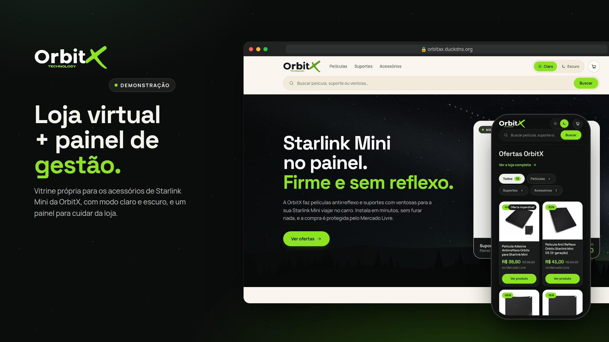
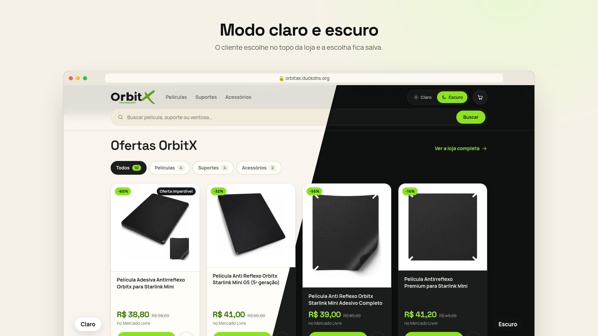
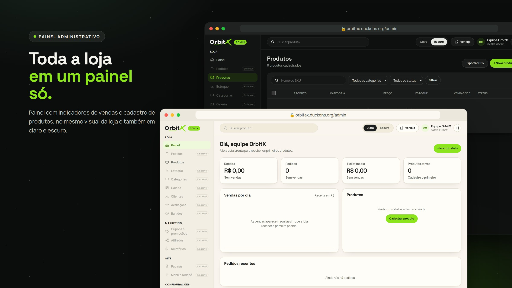
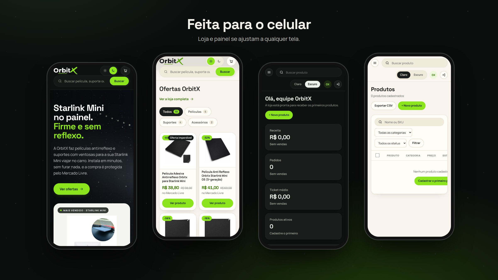

# OrbitX

Site de demonstração da loja **OrbitX Technology** (películas antirreflexo e suportes para Starlink Mini), que hoje vende no Mercado Livre. São duas partes: a loja virtual e o painel administrativo.



**Ver no ar:** [loja](https://orbitax.duckdns.org) · [painel administrativo](https://orbitax.duckdns.org/admin/)

> Versão de apresentação: na loja só a página inicial navega (o resto aparece como "em construção") e no painel só Painel e Produtos funcionam.

## Loja virtual

- Vitrine com os 10 produtos da loja, filtro por categoria e preços consultados no Mercado Livre.
- Modo claro e escuro, escolhido no topo da página e salvo no navegador.
- Layout pensado para o celular primeiro.



## Painel administrativo

- Indicadores de receita, pedidos, ticket médio e produtos ativos.
- Cadastro e lista de produtos com busca e filtros.
- Mesmo visual da loja, também com modo claro e escuro.



## No celular



## Onde está o código

| Parte | Pasta | Branch |
| --- | --- | --- |
| Loja | `site/` | [`site-demo`](https://github.com/Dimasaas/OrbitX/tree/site-demo) (PR #1) |
| Painel | `admin/` | [`claude/admin-panel-cljgk1`](https://github.com/Dimasaas/OrbitX/tree/claude/admin-panel-cljgk1) (PR #2) |

## Tecnologias

| Tecnologia | Para que serve aqui | Quem também usa |
| --- | --- | --- |
| HTML, CSS e JavaScript puro (sem framework) | Loja e painel inteiros, leves e sem dependências | **GitHub**, que tirou o jQuery do GitHub.com e passou a usar JavaScript puro ([blog do GitHub](https://github.blog/engineering/engineering-principles/removing-jquery-from-github-frontend/)) |
| nginx | Servidor que entrega a loja | **Netflix**, nos servidores Open Connect que entregam os vídeos ([Netflix Open Connect](https://openconnect.netflix.com/en/appliances/)) |
| Docker | Empacota a loja em um container (`site/Dockerfile`) | **PayPal**, que roda mais de 150 mil containers Docker ([palestra na DockerCon](https://www.youtube.com/watch?v=huX9cbEyVJw)) |
| Caddy + Let's Encrypt | HTTPS automático na frente do site | **Shopify**, que protege mais de 4,5 milhões de domínios de lojas com Let's Encrypt ([Shopify Engineering](https://shopify.engineering/securing-shopify-domains-letsencrypt)) |

## Rodar localmente

```sh
cd site && python3 -m http.server 8080   # loja em http://localhost:8080
cd admin && python3 -m http.server 8081  # painel em http://localhost:8081
```

---

Starlink é marca de seus respectivos titulares e aparece aqui só para indicar compatibilidade.
